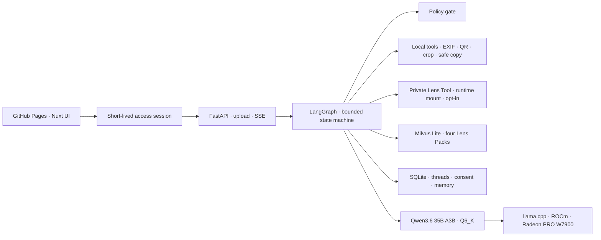

# XiangLens — AMD AI DevMaster 2026 Track 2 Project Brief

## Executive Summary

XiangLens is a private, evidence-backed profile-image review agent for people who communicate across
professional platforms and cultural contexts. It compares one to four candidate avatars against a
user-defined goal, identifies visible privacy risks, retrieves source-backed platform and cultural
context, and remembers preferences only after explicit consent.

An optional private Lens Tool can mount a proprietary 24-lesson, 108-technique course distillation
at runtime. It runs only after explicit per-run opt-in and emits short, safety-filtered symbolic
associations without exposing the source material.

The core multimodal model runs through `llama-server` on an AMD Radeon PRO W7900 with ROCm. The
agent, image tools, Milvus Lite knowledge base, SQLite memory, and uploaded images remain under the
user's control. XiangLens does not identify people or infer personality, employability, health,
wealth, protected attributes, politics, religion, relationships, or future outcomes from an image.

## Application Scenario

A profile image may appear beside every commit, community message, professional introduction, and
hackathon submission. It is repeatedly cropped to a small circle, viewed by different audiences,
and copied across services. A one-shot aesthetic score misses the questions that matter:

- Will the subject survive a circular crop and remain legible at small size?
- Does the file contain GPS, device, timestamp, QR, badge, or screen information?
- Which candidate best matches the user's stated audience and communication goal?
- Which contextual claim is supported by a visible source rather than model intuition?
- Which preference may be remembered, and who approved it?

XiangLens turns that review into a bounded workflow. The user supplies the context, candidate
images, enabled Lens Packs, and intended signals. The agent returns observations, privacy findings,
a transparent comparison rubric, cited evidence, a recommendation, limitations, and an optional
memory proposal.

### Primary users

- open-source contributors choosing a GitHub avatar;
- professionals adapting an image for LinkedIn or a hackathon profile;
- international community members reviewing cross-context ambiguity;
- privacy-conscious users who want local analysis and deletion controls.

### Why this is an Agent rather than a single prompt

The result requires policy routing, state restoration, deterministic image inspection, multimodal
observation, filtered retrieval, comparison, consent, and code-controlled citation rendering. A
single model call cannot safely own all of those decisions.

## Agent Architecture



Production exposes only FastAPI. `llama-server` listens on `127.0.0.1:8000`; Milvus Lite, SQLite,
uploads, private Lens source, model files, and the permanent application key are not public.

## Bounded Agent Workflow

The successful path executes ten auditable nodes:

1. **Intake** — creates a fixed, visible nine-step plan from the request.
2. **Policy gate** — blocks sensitive image-based inference requests.
3. **Recall context** — loads only approved preferences and recent thread messages.
4. **Inspect local** — validates files and measures dimensions, crop, EXIF, and QR evidence.
5. **Observe visual** — asks the self-hosted VLM for visible facts and uncertainty only.
6. **Run private Lens** — when explicitly enabled, applies a mounted private framework and filters
   sensitive claims without exposing its source text.
7. **Retrieve evidence** — searches enabled Milvus Lite Lens Packs with Top-K filtering.
8. **Compare candidates** — applies one transparent five-dimension rubric to two to four images.
9. **Propose memory** — creates a pending proposal only from an explicit user statement.
10. **Synthesize report** — validates typed output and renders citations in application code.

Sensitive requests take a short branch from the policy gate to a blocked report. Each completed node
emits an SSE trace with tool name, status, public summary, and duration. Chain-of-thought is never
included. Direct deployments use that live stream. The GitHub Pages build starts the same graph with
a short `202` request and polls the durable run record because the Radeon public tunnel resets long
HTTP/2 SSE connections; the completed response restores the identical plan and full tool trace.

After the first multimodal run, a follow-up takes an incremental branch. It recalls recent messages,
reuses the completed observations, privacy findings, comparison, and evidence, and makes one bounded
language-model call. The `reuse_analysis` trace states that the VLM was skipped. An explicit memory
statement may add one separate consent-proposal call; ordinary follow-ups do not repeat vision,
private-Lens, comparison, or full-report generation.

## Core Track 2 Capabilities

XiangLens implements all five capabilities listed by the Track 2 rules.

| Capability | XiangLens implementation | Reviewer evidence |
|---|---|---|
| Multi-step task planning | Fixed nine-step plan with conditional policy routing | Plan and node trace in the UI |
| Tool calling | Image validation, EXIF/QR scan, crop metrics, private Lens, safe-copy export | Public trace includes each bounded tool |
| Local RAG | Milvus Lite, four Lens Packs, Top-K retrieval, visible source links | Retrieved Sources panel and nine smoke queries |
| Local multi-turn memory | SQLite same-thread transcript, recent-turn context, approved preferences | Follow-up composer, visible turns, recall trace, approve/delete controls |
| Permission and privacy | Policy gate, short-lived token, consent-first writes, Forget Me | Blocked request, pending proposal, deletion API |

## Model and Local Deployment

### Model

```text
mradermacher/Qwen3.6-35B-A3B-Fable-5-Distill-i1-GGUF:Q6_K
```

- open multimodal model served through an OpenAI-compatible llama.cpp endpoint;
- mixture-of-experts 35B-class model with Q6_K GGUF quantization;
- vision projection loaded by `llama-server`;
- thinking enabled with a separate 2,048-token reasoning allowance;
- typed Pydantic validation with one targeted repair attempt;
- final content is used, while reasoning content is neither displayed nor persisted.

### Local private topology

```text
Browser
  -> XiangLens FastAPI on Radeon Cloud
  -> LangGraph + local tools + Milvus Lite + SQLite
  -> http://127.0.0.1:8000/v1
  -> llama-server on AMD Radeon PRO W7900 / ROCm
```

GitHub Pages hosts static JavaScript only. It is not an inference service. The production FastAPI
base URL is build-time public configuration; the permanent application key stays on the Radeon
host. FastAPI issues a random, visitor-scoped Bearer token with a 10–30 minute lifetime.
The browser proactively rotates a still-valid token before expiry through an authenticated endpoint;
the replacement keeps the same session identity, so an in-progress run and its follow-up thread are
not orphaned.

See [Production Deployment Guide](PRODUCTION_DEPLOYMENT.md) and [ROCm Reproduction Steps](REPRODUCE.md).

## AMD Radeon and ROCm Optimization

XiangLens targets an interactive, batch-size-1 workload instead of maximum multi-user throughput.

| Optimization | Implementation | Benefit |
|---|---|---|
| llama.cpp runtime | HIP build with full GPU layer offload | Direct GGUF execution on Radeon/ROCm |
| Q6_K model | Quantized 35B-class multimodal model | Fits the single W7900 while retaining capability |
| Flash attention | Enabled in the verified llama-server command | Reduces attention cost and memory traffic |
| Quantized KV cache | Q8_0 K/V cache in the verified command | Reduces context-cache footprint |
| Top-K RAG | Inject four relevant cards rather than the full corpus | Reduces prompt prefill |
| CPU retrieval | FastEmbed/hashed vectors do not compete for GPU VRAM | Preserves VRAM for the VLM |
| Deterministic tools first | EXIF, QR, crop, and size checks run before the VLM | Avoids spending tokens on objective checks |
| Small typed calls | Visual facts, comparison, memory, and report use bounded schemas | Reduces output length and repair cost |
| Reasoning headroom | Final-content and thinking budgets are separated | Prevents empty final responses |
| Dual run transport | Local SSE plus short-request polling through the public tunnel | Preserves traceability without HTTP/2 resets |

The project reports llama.cpp performance empirically. It does not claim that one hardware feature
alone explains a difference from vLLM. Exact prompt, image, quantization, context, cache, warmup, and
launch settings must accompany every comparison.

The reproducible runner in `scripts/benchmark_llama.py` records streaming TTFT, final-content TTFT,
end-to-end model latency, server-reported prompt/decode throughput, and structured-output success.
See [Radeon Benchmark Protocol](../benchmarks/README.md).

### Measured W7900 Result — 2026-08-05

The production-shaped capture used Q6_K GGUF, full GPU layer offload, flash attention, Q8_0 K/V
cache, a 2,048-token reasoning budget, and a 384-token final-output budget. One warmup preceded five
measured batch-size-1 multimodal requests.

| Metric | Optimized warm capture |
|---|---:|
| First generated delta, median | 87.09 ms |
| First final-content delta, median | 9,960.18 ms |
| End-to-end model latency, median | 11,919.78 ms |
| Decode throughput, median | 83.42 tok/s |
| Valid structured JSON | 100% (5/5) |

A separate cold reference recorded 825.58 ms to the first generated delta, 12,694.04 ms total
latency, and 83.16 tok/s decode throughput. The final-content SHA-256 is identical across all six
captured runs. Review the [optimized result](../benchmarks/results/llama_cpp_w7900_optimized.md) and
[cold reference](../benchmarks/results/llama_cpp_w7900_cold.md).

This is evidence for the tuned deployment stack, not a controlled vLLM comparison or proof that one
flag caused the difference. Peak VRAM and GPU utilization remain separate video evidence because
the committed benchmark files do not contain ROCm telemetry.

## Knowledge and Evidence

The public corpus deliberately remains small and inspectable:

| Lens Pack | Purpose | P0 cards |
|---|---|---:|
| `profile_basics` | Crop, clarity, scale, and composition | 8 |
| `privacy_safety` | Metadata and visible disclosure risks | 8 |
| `global_professional_context` | GitHub, LinkedIn, Discord, and profile contexts | 10 |
| `open_chinese_symbolism` | Bounded, source-backed motif context | 6 |

Every card has text, pack, source, and tags. Sources and licenses are stored separately. Eight smoke
queries verify that the relevant card appears in the top four. Cultural context is presented as
documented association and ambiguity, never as personality, destiny, or a universal audience
reaction.

The private Lens Tool is deliberately separate from these four public packs. Its course source is
loaded from an operator-controlled path into process memory, never committed, copied into the
public Milvus collection, or returned by an API. Code filters personality, health, wealth,
relationship, criminality, protected-attribute, and predictive claims before rendering.

## Memory, Permission, and Deletion

- A user statement must explicitly signal a reusable preference or correction.
- The model may draft a proposal but cannot write memory.
- The UI requires approval or rejection.
- SQLite records the consent provenance and source thread.
- A later review under the same access identity recalls approved memory.
- Recalled preference text expands Milvus evidence retrieval and informs intent alignment.
- A user can delete one memory or invoke **Forget all private state**.
- Uploaded paths are constrained to the controlled runtime directory before deletion.
- Short-lived tokens scope public visitors to separate identities.

## Demonstration Scenario

1. Upload `portrait_01__clean.jpg` and `portrait_01__qr_code.jpg`.
2. Ask XiangLens to choose a credible, approachable GitHub avatar for international collaborators.
3. Opt into the mounted private Lens Tool and show one technique reference plus its bounded
   symbolic-association disclaimer.
4. Show the bounded plan, local QR finding, source-backed evidence, comparison rubric, and safe-copy
   export.
5. Ask a follow-up in the visible same-thread conversation and show prior-message recall.
6. State “I like cartoon-style avatars, but I am worried about copyright,” approve the proposal,
   click **New review · keep memory**, and show recall, WIPO evidence retrieval, and deletion.

This scenario proves tool calling, multimodal inference, RAG, comparison, memory, permission, and
privacy in one coherent multi-turn workflow.

## Verification

```bash
uv run ruff check src tests scripts
uv run pytest -q
uv run python scripts/build_knowledge_db.py --provider hash
uv run python scripts/run_rag_smoke.py
pnpm --dir apps/web typecheck
pnpm --dir apps/web build
```

The repository also contains 120 deterministic image fixtures with source, license, labels, and
hash manifests. Production code never substitutes fixture output or fake model output for the real
self-hosted model path.

## Submission Navigation

- [README](../README.md) — environment, dependencies, API, startup, and tests;
- [Application Design](XIANGLENS_APPLICATION_DESIGN.md) — detailed product and engineering design;
- [Local Development](LOCAL_DEVELOPMENT.md) — developer startup;
- [Production Deployment](PRODUCTION_DEPLOYMENT.md) — final Radeon topology;
- [Private Lens Tool](PRIVATE_LENS_TOOL.md) — local mount, safety boundary, and demo setup;
- [Dataset Plan](KNOWLEDGE_BASE_DATASET_PLAN.md) — knowledge and image provenance;
- [Benchmark Protocol](../benchmarks/README.md) — reproducible Radeon measurements;
- [Demo Video Script](DEMO_VIDEO_SCRIPT.md) — exact 3–5 minute recording plan;
- [Submission Checklist](SUBMISSION_CHECKLIST.md) — requirement-to-evidence matrix.
