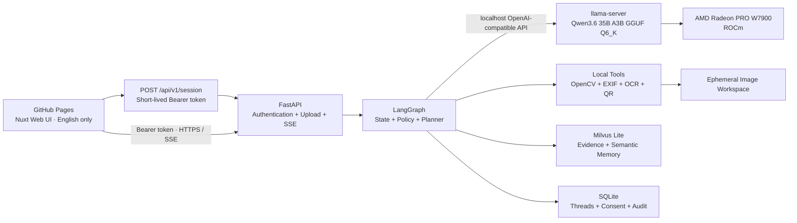
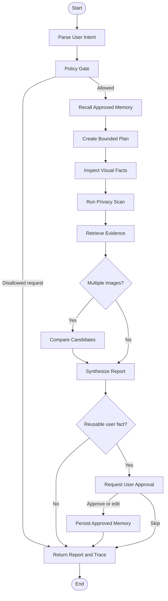

# XiangLens Application Design

> **AMD AI DevMaster 2026 — Track 2: Private AI Agent Development and Local Deployment**
> Document status: Implementation draft v0.3
> Updated: July 25, 2026
> Project name: **XiangLens**
> Product language: **English only**

## 1. Executive Summary

XiangLens is a private, cross-context profile-image agent that runs entirely on an AMD Radeon GPU. It helps users select safer and more context-appropriate avatars for professional, open-source, social, and cross-cultural settings without uploading images, preferences, or conversation history to a third-party AI service.

The product addresses a practical form of context collapse: one image may be seen by friends, recruiters, open-source collaborators, customers, and international event judges, even though those audiences have different expectations. The same image may also expose EXIF location data, badges, QR codes, screens, or background text that the user did not intend to publish.

XiangLens does not infer personality, health, wealth, criminality, relationships, religion, political views, or destiny from an image. It separates observable visual facts from contextual interpretation, retrieves source-backed evidence, explains uncertainty, and makes recommendations only against goals explicitly provided by the user.

The project reuses the upload and visual-analysis entry point from the existing `avatar-reader` prototype, but replaces the one-shot prompt workflow with a local agent that demonstrates all five Track 2 capabilities:

1. Local retrieval-augmented generation;
2. Tool calling;
3. Multi-step planning;
4. Local short-term and long-term memory;
5. Explicit permission and privacy controls.

The primary model is already running successfully on ROCm:

```text
mradermacher/Qwen3.6-35B-A3B-Fable-5-Distill-i1-GGUF:Q6_K
```

The production application will use `llama-server`, not `llama-cli`, so LangGraph can access the model through a localhost OpenAI-compatible API. The selected inference engine is `llama.cpp`, based on project measurements showing materially higher token-generation speed than the tested vLLM deployment on the Radeon PRO W7900 for this model and single-user workload.

## 2. Final Product Decisions

| Decision | Selection | Rationale |
|---|---|---|
| Project name | XiangLens | Distinctive, relevant to images and symbolic context, and less crowded than PersonaLens |
| Product theme | Private cross-context profile-image agent | Globally understandable problem with a clear privacy need |
| Product language | English only | The competition, documentation, code, UI, demo, and video are all international-facing |
| Localization | Out of scope | No language selector, translation layer, locale state, or i18n dependency |
| Agent framework | LangGraph | Explicit state, deterministic routing, persistence, tool traces, and human approval nodes |
| Agent style | Bounded planner plus controlled graph | More stable and auditable than an unrestricted ReAct loop |
| Inference engine | llama.cpp / llama-server | Best observed generation speed on the actual W7900 deployment |
| Model | Qwen3.6 35B A3B Fable 5 Distill GGUF Q6_K | Already deployed and verified with visual input on ROCm |
| Vector database | Milvus Lite | Sufficient for the small local corpus and easy to migrate later |
| Transactional storage | SQLite | Authoritative state for threads, consent, audit, and structured memory |
| Knowledge design | 32 short P0 knowledge cards in four local Lens Packs | Visible sources, stable retrieval, and low authoring cost |
| Private course material | Excluded from the submission | Redistribution rights are unclear |

### 2.1 Why PersonaLens Was Rejected

`PersonaLens` is already the name of an ACL 2025 Findings benchmark for personalization in conversational assistants. It also appears in existing AI headshot, talent-assessment, and design-review products. A duplicate name would not automatically establish legal infringement, but it would create unnecessary search, attribution, and reviewer confusion.

XiangLens is the selected competition name. A formal trademark search remains a pre-launch task if the project continues beyond the hackathon.

## 3. Product Definition

### 3.1 One-Sentence Pitch

> **XiangLens is a private AI agent that helps people choose safer and more context-appropriate profile images without sending those images to a third-party AI service.**

### 3.2 Core User Questions

XiangLens is designed to answer:

1. What is objectively visible in this image?
2. Does the image expose information the user may not have noticed?
3. How well does it fit the platform, audience, and intent selected by the user?
4. What source-backed contextual or cultural interpretations may be relevant?
5. Which candidate image best fits the user's stated goal?
6. Should a user-confirmed preference be remembered for future sessions?

It is not designed to answer:

> “What kind of person is this based on the avatar?”

### 3.3 Product Principles

- **Intent first:** analyze an image only against a goal supplied by the user.
- **Observation before interpretation:** clearly separate visual facts from contextual hypotheses.
- **Evidence before assertion:** contextual claims require retrieved evidence.
- **Private by default:** images are ephemeral unless the user explicitly opts in to retention.
- **Consent before memory:** long-term memory stores only user-stated or user-confirmed information.
- **No sensitive inference:** never infer protected or high-impact personal attributes from an image.
- **User correction wins:** confirmed user context overrides generic model assumptions.
- **Local and inspectable:** inference, retrieval, tools, and storage run inside the user's instance.
- **English only:** every user-facing string, prompt, report, document, and video caption is English.

## 4. Target Users and Scenarios

### 4.1 Primary Users

- Developers joining international hackathons or open-source communities;
- Students and researchers building a global professional presence;
- Independent creators using different identities across professional and social contexts;
- Privacy-conscious users who do not want facial or identity images sent to cloud AI services.

### 4.2 Primary Demo Scenario

A Chinese developer is preparing for an international hackathon and has three candidate profile images. The user wants to appear:

- technically credible;
- approachable;
- visually distinctive;
- appropriate for GitHub, LinkedIn, and a private messaging community;
- free from accidental disclosure of employer, location, or contact information.

The agent clarifies the goal, inspects the images, scans for privacy risks, retrieves platform and cultural-context evidence, compares candidates, and explains the recommendation. The user then corrects the agent:

> “Red is an intentional part of my brand identity. Do not treat it as a negative signal.”

XiangLens proposes an exact memory, requests permission, saves it only after approval, and applies it correctly in a new conversation.

### 4.3 Secondary Scenarios

- Compare a real photo, illustration, and logo for different communities;
- Check an existing avatar for EXIF, QR codes, badges, or readable background text;
- Import a private brand guide as a local Lens Pack;
- Review previous choices and user-confirmed outcomes without retaining the original images.

## 5. Scope

### 5.1 MVP Scope

- Single-image review;
- Comparison of two to four candidate images;
- Platform, audience, and communication-goal inputs;
- Objective visual observation;
- EXIF, QR, OCR, and background privacy scanning;
- Local RAG with visible source cards;
- English-only reports and conversations;
- Multi-turn threads;
- User-approved long-term preferences;
- Memory view, edit, and deletion controls;
- Visible agent plan and tool trace;
- Metadata-stripped safe-copy export;
- AMD Radeon and ROCm runtime metrics;
- Before-and-after performance benchmark.

### 5.2 Optional Features

- User-adjustable comparison weights;
- Private Lens Pack import;
- Avatar-choice history without retaining original images;
- Markdown or PDF report export.

### 5.3 Explicit Non-Goals

- No image generation or image-editing pipeline;
- No automated posting to social platforms;
- No face identification or person search;
- No personality, intelligence, health, financial, relationship, or criminality assessment;
- No claim that a cultural interpretation represents every member of a culture;
- No unrestricted autonomous agent or shell access;
- No multi-agent team unless a later requirement justifies it;
- No public redistribution of the private 108-technique course;
- No internationalization or localization implementation.

## 6. User Experience

### 6.1 Modes

#### Quick Review

Upload one image, select a target context, and receive an evidence-backed privacy and context review.

#### Compare

Upload two to four images and compare them against the same transparent rubric.

#### Ongoing Profile

Allow XiangLens to remember confirmed goals, brand constraints, and corrections across sessions.

### 6.2 First-Run Flow

1. The application states that all AI inference runs locally on AMD Radeon.
2. The default retention option is “Use for this session only.”
3. The user uploads one to four images.
4. The user selects the target platform or context.
5. The user enters the audience and three intended signals.
6. XiangLens displays a bounded plan.
7. Tools run in visible stages: observation, privacy, retrieval, and comparison.
8. The report separates facts, risks, context, evidence, and recommendations.
9. Any proposed long-term memory appears as a separate approval card.
10. The user can inspect or delete memory in the Memory Center.

### 6.3 Result Language

Preferred wording:

- “The image visibly contains…”
- “For the GitHub context you selected…”
- “Source A documents this symbol in a specific historical context…”
- “This does not predict how every viewer will react.”
- “The evidence is limited, so this should be treated as a possible ambiguity.”
- “This is a fit assessment against your goal, not a personality assessment.”

Prohibited wording:

- “You are the kind of person who…”
- “Western viewers will always think…”
- “This color means you will…”
- “The image reveals your health, wealth, or future.”

### 6.4 Candidate Comparison Rubric

| Dimension | Meaning | Result Type |
|---|---|---|
| Privacy safety | Metadata, QR, badge, location, screen, or sensitive text risk | Hard risk |
| Small-size clarity | Whether the subject remains recognizable at avatar sizes | Measured |
| Crop resilience | Whether circular and square crops preserve the intended subject | Measured |
| Intent alignment | Fit with user-provided communication goals | Goal-relative |
| Platform compliance | Fit with official technical or policy requirements | Evidence-backed |
| Distinctiveness | Ability to remain identifiable among similar avatars | Goal-relative |
| Contextual ambiguity | Possible conflicting readings across contexts | Warning, not a penalty |
| Evidence coverage | Strength and relevance of supporting evidence | Confidence |

The weights are visible. Privacy risks override the aggregate recommendation.

## 7. System Architecture



### 7.1 Deployment Boundary

All core services run in one user-controlled AMD Radeon environment:

```text
GitHub Pages
  -> POST /api/v1/session
  <- 10–30 minute visitor-scoped Bearer token
  -> authenticated XiangLens application
  -> FastAPI and LangGraph
  -> 127.0.0.1 llama-server
  -> AMD Radeon PRO W7900 through ROCm
```

If the UI is exposed through Radeon Cloud tunnel, authentication is mandatory. The model port, Milvus database file, SQLite database, and runtime directory remain bound to localhost or local storage only.

The FastAPI host owns the permanent `XIANG_APP_API_KEY` and derives signed, stateless access tokens
from it with domain-separated HMAC-SHA256. The permanent value is never compiled into Nuxt, entered
by a visitor, or stored in the browser. `POST /api/v1/session` is the only unauthenticated versioned
route. It is CORS-restricted, locally rate-limited, and returns a random session identity with a
configurable 10–30 minute lifetime. All user-owned routes enforce that identity, preventing public
visitors from sharing threads or memories. Production should add an edge rate limit through the
Radeon ingress or an optional Cloudflare Worker.

Local development does not require a Radeon GPU on the developer workstation. Before the UI is deployed to the competition machine, the Mac application may connect through a private authenticated URL to the same user-controlled llama.cpp service running on Radeon Cloud. This is a development topology only. The final demo and submission run FastAPI beside llama-server and set `XIANG_LLM_BASE_URL=http://127.0.0.1:8000/v1`, satisfying the requirement that core inference not depend on a third-party remote API.

### 7.2 Storage Responsibilities

Milvus is used for similarity retrieval. SQLite is the authoritative state store.

| Storage | Responsibility |
|---|---|
| Milvus Lite | Evidence chunks, semantic memory projections, similar prior outcomes |
| SQLite | Threads, consent records, structured memory, audit events, deletion status |
| Temporary workspace | Images required for the current run |
| Optional history store | Only user-approved derivatives or hashes |

Deleting a memory must remove both the SQLite record and the corresponding Milvus vector.

## 8. Agent Design

### 8.1 Controlled Graph Instead of Unrestricted ReAct

The model is responsible for semantic understanding, bounded planning, visual interpretation, evidence synthesis, and natural-language output. Code controls execution order, permissions, storage, and error handling.

This design provides:

- repeatable demo behavior;
- a visible mapping to Track 2 planning and orchestration requirements;
- mandatory privacy scanning;
- a human approval pause before memory writes;
- a tool allowlist and validated arguments;
- graceful recovery when structured output is invalid;
- an auditable trace without exposing chain-of-thought.

### 8.2 State Graph



### 8.3 Agent State

```python
class XiangLensState(TypedDict):
    thread_id: str
    user_id: str
    messages: list

    mode: Literal["review", "compare", "follow_up"]
    platforms: list[str]
    audience: str
    intent_keywords: list[str]
    constraints: list[str]

    image_refs: list[str]
    image_hashes: list[str]
    retention_policy: Literal["memory_only", "session", "history"]

    plan: list[dict]
    observations: list[dict]
    privacy_findings: list[dict]
    retrieved_evidence: list[dict]
    recalled_memories: list[dict]
    comparison: dict | None

    policy_flags: list[str]
    pending_memory: list[dict]
    consent_request_id: str | None

    final_report: dict | None
    tool_trace: list[dict]
    performance_metrics: dict
```

There is no locale or translation state.

### 8.4 Tools

| Tool | Purpose | Permission |
|---|---|---|
| `inspect_visual` | Structured VLM observation of visible content | Session |
| `measure_image` | Size, aspect ratio, crop resilience, palette, small-size preview | Session |
| `scan_privacy` | EXIF, OCR, QR, badge, screen, and location-risk candidates | Session |
| `run_private_lens` | Apply a locally mounted private course framework after opt-in | Per-run opt-in |
| `retrieve_evidence` | Search enabled public Lens Packs in Milvus | Read-only |
| `recall_user_memory` | Search approved user memory with a user-ID filter | Read-only |
| `compare_candidates` | Compare images with one transparent rubric | Session |
| `export_safe_copy` | Produce a metadata-stripped derivative | Explicit approval |
| `propose_memory` | Create an approval card without writing | No write |
| `save_memory` | Persist an approved memory | Explicit approval |
| `delete_memory` | Remove SQLite and Milvus records | Explicit approval |

### 8.5 Tool Constraints

- Tool names are code-defined enums.
- Parameters are validated with Pydantic schemas.
- Tools receive internal image references, never arbitrary filesystem paths.
- The model has no shell, network, database-file, or unrestricted filesystem access.
- Privacy scanning and the policy gate are mandatory graph nodes.
- Every invocation records timing, status, and a redacted summary.
- Write tools require a valid consent token.
- The UI shows actions and evidence, not hidden model reasoning.

## 9. Knowledge Base Strategy

The detailed card list and source policy are maintained in the [XiangLens Knowledge Base Plan](./KNOWLEDGE_BASE_DATASET_PLAN.md). The hackathon corpus is intentionally small: **32 P0 knowledge cards** across four Lens Packs, with 50 as an optional stretch target.

| Lens Pack | Purpose | P0 |
|---|---|---:|
| `profile_basics` | Crop, clarity, composition, and small-size behavior | 8 |
| `privacy_safety` | EXIF, QR, badge, screen, and visible-text risks | 8 |
| `global_professional_context` | GitHub, LinkedIn, and Discord profile context | 10 |
| `open_chinese_symbolism` | A limited set of documented motifs and cultural associations | 6 |

Each card has only four author-written fields:

```yaml
- text: "GitHub avatars appear across collaboration surfaces. The subject should remain recognizable after a small circular crop."
  pack: profile_basics
  source: github_profile_reference
  tags: [github, crop, small-size]
```

`sources.yaml` stores the title, URL, and license label once per source. The build script generates the card ID, source metadata, timestamp, and embedding. No chunking is required because each card is already retrieval-sized.

The P0 corpus uses official documentation, project-authored heuristics, and two or three thematic museum education pages. Several cultural cards may cite the same thematic page. It does not require museum APIs, individual object selection, object-level provenance, a review workflow, automated lints, a reranker, hybrid search, or a large gold-query set. Those are post-hackathon improvements.

Private course material remains outside the repository and public database. Cultural cards describe a documented association and never claim that all modern viewers interpret a motif identically or that an image predicts its owner's personality or future.

The implemented private Lens adapter accepts a plain-text/Markdown file or a JavaScript/TypeScript
template-literal export. It loads the reference into server memory, invokes it only after an
explicit request flag, exposes only filtered readings, and never returns the reference text or path
to the browser. This is a Tool extension, not a fifth public Milvus Lens Pack.

### 9.1 Image Fixture Pack

The repository also contains **120 actual 512-by-512 JPEG fixtures** for visual and tool evaluation. This layer is separate from Milvus:

- 80 portrait fixtures exercise crop, scale, contrast, multiple-subject, OCR, QR, badge, screen, location-sign, GPS EXIF, and device EXIF behavior;
- 40 cultural fixtures exercise bat, lotus, dragon, and bamboo imagery under clean, circular, small-subject, low-contrast, and busy-background conditions.

All fixtures are derived deterministically from 24 existing open-license Wikimedia Commons images, plus one public-domain QR overlay source. No AI-generated image is included. The source and fixture manifests retain the Commons page, credit, license, and SHA-256 hash. Image embeddings and image-to-image search remain out of P0; the VLM and local tools consume the images, while Milvus consumes the short evidence cards.

## 10. RAG and Milvus Lite

### 10.1 Why Milvus Lite Is Sufficient

Milvus Lite provides:

- local file persistence;
- vector CRUD;
- metadata filtering;
- a compatible migration path to Milvus Standalone or Distributed.

Thirty-two P0 cards are far below the scale that requires a standalone vector service. The demo needs one local FastAPI process, one generated Milvus Lite file, dense-vector search, and simple pack filtering. Production concerns such as high concurrency, multi-tenancy, database RBAC, and distributed deployment are explicitly out of scope.

### 10.2 Knowledge Collection

Collection: `knowledge_cards_v1`

| Field | Type | Purpose |
|---|---|---|
| `id` | VARCHAR primary key | Generated stable hash |
| `text` | VARCHAR | English retrieval text |
| `vector` | FLOAT_VECTOR | Locally generated embedding |
| `pack` | VARCHAR | Lens Pack filter |
| `source` | VARCHAR | Key in `sources.yaml` |
| `source_title` | VARCHAR | Generated citation title |
| `source_url` | VARCHAR | Generated citation link |
| `license` | VARCHAR | Generated license label |
| `tags_json` | VARCHAR | Small list of retrieval hints |

The editable YAML remains the source of truth; the Milvus Lite file is a disposable build artifact.

### 10.3 User Memory Collection

Collection: `user_memory_v1`

| Field | Type | Purpose |
|---|---|---|
| `memory_id` | VARCHAR primary key | Memory identifier |
| `user_id` | VARCHAR | Mandatory filter |
| `text` | VARCHAR | English semantic projection |
| `dense_vector` | FLOAT_VECTOR | Search vector |
| `memory_type` | VARCHAR | Preference, goal, correction, or outcome |
| `source_thread_id` | VARCHAR | Provenance |
| `consent_id` | VARCHAR | Permission record |
| `confidence` | FLOAT | Direct user statements are 1.0 |
| `active` | BOOL | Deletion and validity state |
| `created_at` | VARCHAR | Timestamp |
| `expires_at` | VARCHAR | Optional expiry |

SQLite remains authoritative for consent and active status.

### 10.4 Retrieval Flow

```text
Query
  = user goal
  + selected platform/context
  + objective visual tags
  + enabled Lens Packs

Filter
  = enabled Lens Packs

Search
  = dense top 4
  -> attach source metadata
  -> pass four cards to the synthesis node
```

The synthesis node cites retrieved cards for platform, privacy, and cultural context. If the four cards do not support a claim, the report omits it or states that the knowledge base is insufficient.

## 11. Memory System

### 11.1 Memory Types

| Type | Example | Persistence Rule |
|---|---|---|
| Short-term | Current images, platform, and follow-up questions | Automatic within one thread |
| Semantic | “Red is an intentional brand color.” | Explicit user approval |
| Episodic | “The user selected candidate B for GitHub.” | Explicit confirmation and approval |

Safety policy is code-controlled procedural state and cannot be rewritten through conversation.

### 11.2 Never Memorize Automatically

- inferred personality or identity;
- sensitive attributes;
- unconfirmed cultural interpretations;
- original face images;
- OCR-detected contact information;
- badge, location, or QR contents;
- anything marked “session only.”

### 11.3 Memory Write Flow

```text
Agent identifies a reusable user-provided fact
  -> creates an exact memory proposal
  -> UI shows text, type, reason, and expiry
  -> user edits, approves, or skips
  -> SQLite stores the consent and structured memory
  -> Milvus stores the searchable projection
```

### 11.4 Memory Center

Users can:

- view every memory;
- inspect source thread and approval time;
- edit or expire a memory;
- pause all memory use;
- delete one item or everything;
- export memory as JSON.

“Forget me” deletes SQLite records, Milvus vectors, image hashes, and history links. The remaining audit event contains no deleted text.

## 12. Privacy, Permissions, and Security

### 12.1 Default Image Lifecycle

1. The browser uploads an image to the local instance.
2. The API assigns an unguessable temporary reference.
3. Tools use the internal reference.
4. The image is deleted when the run or session expires.
5. No original or thumbnail is persisted by default.
6. History retention requires separate approval.

### 12.2 Permission Matrix

| Action | Default | Rule |
|---|---:|---|
| Analyze current upload | Allowed | Granted by upload for the current session |
| Read public Lens Packs | Allowed | Read-only |
| Read approved memory | Allowed | Can be globally paused |
| Write long-term memory | Denied | Explicit approval required |
| Save original image | Denied | Separate approval required |
| Export safe derivative | Denied | User-triggered action |
| Network tool access | Denied | No runtime web tool |
| Arbitrary file access | Denied | Controlled workspace only |

### 12.3 Security Controls

- Validate extension, MIME hint, file signature, decoded dimensions, and maximum pixels.
- Reject or rasterize SVG.
- Generate server-side random filenames.
- Sanitize Markdown-rendered HTML.
- Never expose absolute server paths in SSE events.
- Bind model and storage services to localhost.
- Require authentication for a public tunnel.
- Keep the permanent application key server-side and issue 10–30 minute Bearer tokens.
- Scope threads, consent, memories, and deletion to the signed session identity.
- Rate-limit uploads and enforce session expiry.
- Exclude models, databases, uploads, private packs, and secrets from Git.

## 13. Model Runtime and Inference Engine

### 13.1 Selected Runtime

Development prompt testing may continue with `llama-cli`, but the application runtime uses `llama-server`:

```text
llama-server
  -hf mradermacher/Qwen3.6-35B-A3B-Fable-5-Distill-i1-GGUF:Q6_K
  --host 127.0.0.1
  --port 8000
  ...the already verified ROCm, vision, context, and GPU-offload parameters
```

The final start script must use the exact arguments verified on the competition machine. Unverified llama.cpp flags should not be copied into the submission merely because they exist in another build.

LangGraph connects through an OpenAI-compatible client:

```python
llm = ChatOpenAI(
    model="xianglens-qwen3.6-35b-a3b-fable5-q6k",
    base_url="http://127.0.0.1:8000/v1",
    api_key="local-only",
    temperature=0.2,
)
```

### 13.2 llama.cpp Versus vLLM Decision

The project has observed that llama.cpp generates tokens materially faster than the tested vLLM deployment on the Radeon PRO W7900 for the current quantized model and interactive single-user workload. Therefore:

- llama.cpp is the final application runtime;
- vLLM is retained only as a benchmark comparison;
- the report optimizes for interactive latency and batch size 1, not maximum multi-user throughput;
- all comparison claims must include exact software versions, model formats, quantization, context size, batch settings, and launch arguments.

### 13.3 FP8 Wording

The submission should not state as a proven fact that “llama.cpp is faster only because the W7900 does not support FP8.” The evidence supports a narrower statement:

- AMD identifies the W7900 as an RDNA 3 GPU and publishes FP16 matrix and INT8/INT4 matrix performance for it, but does not publish an FP8 matrix-throughput figure on the product specification page;
- AMD's ROCm vLLM FP8 hardware-acceleration guidance is centered on Instinct MI300 and MI350 series GPUs;
- the absence of the same documented FP8 acceleration path on W7900 is a plausible contributor;
- vLLM framework overhead, PyTorch/Triton kernels, model representation, batching strategy, warmup, and quantization compatibility may also affect the measured result.

Recommended report wording:

> On our Radeon PRO W7900 test environment, llama.cpp with the Q6_K GGUF model delivered higher batch-1 token-generation speed than our tested vLLM configuration. The W7900's documented matrix formats and the Instinct-focused FP8 acceleration path may contribute to this result, but we report it as an empirical system-level measurement rather than attributing it to a single cause.

### 13.4 Structured Output

Each graph node asks for a small typed object rather than one long report:

- `UserIntent`;
- `BoundedPlan`;
- `VisualFacts`;
- `CandidateComparison`;
- `AnalysisReport`.

Validation sequence:

1. Use JSON Schema or grammar support available in the verified llama.cpp build.
2. Validate with Pydantic.
3. Allow one targeted repair request.
4. Return a recoverable error if validation still fails.
5. Never execute a write from unvalidated model output.

## 14. API and UI

### 14.1 Implemented API

| Method | Path | Purpose |
|---|---|---|
| `POST` | `/api/v1/threads` | Create a thread |
| `POST` | `/api/v1/threads/{id}/images` | Upload one to four images |
| `POST` | `/api/v1/threads/{id}/runs` | Execute the graph and return one structured result |
| `POST` | `/api/v1/threads/{id}/runs/async` | Start a background graph run and return `202` plus a run ID |
| `POST` | `/api/v1/threads/{id}/runs/stream` | Execute the graph and stream SSE node events |
| `GET` | `/api/v1/threads/{id}` | Restore thread state |
| `GET` | `/api/v1/threads/{id}/state` | Restore images and recent messages |
| `GET` | `/api/v1/threads/{id}/runs` | List saved run results |
| `GET` | `/api/v1/runs/{run_id}` | Read one run result |
| `DELETE` | `/api/v1/threads/{id}` | Delete thread and temporary images |
| `POST` | `/api/v1/consents/{id}` | Approve, edit, or reject a proposal |
| `GET` | `/api/v1/memories` | List approved memories |
| `DELETE` | `/api/v1/memories/{id}` | Delete one memory |
| `DELETE` | `/api/v1/privacy/forget-me` | Delete all state for one user |
| `POST` | `/api/v1/threads/{id}/images/{image_id}/safe-copy` | Export a cleaned derivative |
| `GET` | `/api/v1/lens-packs` | List packs, versions, and rights |
| `GET` | `/api/v1/system/status` | Show model, ROCm, GPU, and storage status |

### 14.2 SSE Events

```text
run.started
node.completed
run.completed
run.failed
```

`node.completed` carries the public tool trace and the bounded plan when it first becomes
available. It never includes chain-of-thought or absolute server paths. Finer-grained token and
tool events remain an optional post-MVP extension.

GitHub Pages uses the async endpoint and polls `GET /api/v1/runs/{run_id}` because the Radeon public
tunnel can reset long HTTP/2 SSE streams. Direct local connections retain SSE. Both transports
return the same validated result, fixed plan, and public tool trace.

### 14.3 Main Workspace

```text
┌────────────────┬──────────────────────────┬───────────────────┐
│ Images         │ Agent conversation       │ Evidence and Risk │
│ crop previews  │ plan / tools / report    │ sources / privacy │
└────────────────┴──────────────────────────┴───────────────────┘
```

Primary panels:

- Observed;
- Privacy;
- Context;
- Compare;
- Evidence;
- Memory;
- Trace;
- Local Runtime.

There is no language selector and no translated UI bundle.

### 14.4 Local Runtime Panel

Display:

- GPU model;
- ROCm version;
- llama.cpp commit or release;
- model repository and Q6_K quantization;
- localhost endpoint;
- time to first token;
- decode tokens per second;
- end-to-end latency;
- peak VRAM;
- tool latency waterfall.

## 15. Safety, Ethics, and Intellectual Property

### 15.1 Disallowed Inferences

Never infer from a profile image:

- disease, pregnancy, fertility, or lifespan;
- criminality, legal trouble, or fraud susceptibility;
- wealth, debt, or investment outcomes;
- relationship loyalty or sexual orientation;
- religion, politics, or protected attributes;
- intelligence, employability, or personality diagnosis;
- destiny or specific future events.

### 15.2 Allowed Contextual Language

Allowed:

> “This open museum record documents the motif in a specific historical context. It does not predict how every modern viewer will interpret the image.”

Disallowed:

> “This motif reveals the owner's character and future.”

### 15.3 Private Course Material

- Remove the private course text from public code and prompts.
- Do not include distilled course content in Milvus.
- Do not show course text in the demo video.
- Keep the Lens Pack interface generic.
- Ship only original, public-domain, CC0, or explicitly licensed content.
- Record source, publisher, URL, rights, and usage mode.
- Run a repository rights audit before submission.

## 16. AMD Radeon Optimization and Benchmarking

### 16.1 Proof of Local GPU Inference

The report and video must show:

- the W7900 device and ROCm environment;
- llama-server using the local GGUF;
- GPU offload and VRAM use;
- GPU utilization during inference;
- the application model endpoint at `127.0.0.1`;
- no third-party AI base URL;
- local Milvus and SQLite paths.

### 16.2 Application-Level Optimizations

| Optimization | Mechanism | Expected Benefit |
|---|---|---|
| RAG instead of full knowledge prompt | Inject only four cards | Less prefill work |
| Image normalization | Limit unhelpful resolution while preserving evidence | Fewer visual tokens |
| Deterministic tools first | EXIF, size, crop, palette, and QR in code | Avoid unnecessary VLM work |
| Image-hash cache | Reuse objective features for repeated inputs | Lower repeated latency |
| Small typed nodes | Generate compact JSON before the report | Fewer long-output failures |
| SSE streaming | Show progress and tokens immediately | Better perceived latency |
| Prompt/KV cache | Enable only after verification in the exact build | Reuse stable prefixes |
| CPU embedding | Avoid competing with the 35B model for VRAM | Better single-GPU stability |

### 16.3 Benchmark Matrix

| Runtime | Model Representation | Workload | Purpose |
|---|---|---|---|
| llama.cpp | GGUF Q6_K | Batch 1, interactive | Selected production path |
| vLLM | Exact tested format | Same prompts and images | Framework comparison |
| llama.cpp full prompt | GGUF Q6_K | Full knowledge injection | RAG baseline |
| llama.cpp optimized | GGUF Q6_K | Top-K RAG and feature cache | Final application result |

Test set:

- five single-image reviews;
- three two-image comparisons;
- two four-image comparisons;
- at least three repetitions;
- cold and warm runs reported separately.

Metrics:

- input tokens;
- time to first token;
- decode tokens per second;
- end-to-end latency;
- tool latency;
- peak VRAM;
- GPU utilization;
- valid structured-output rate;
- retry count.

Do not compare different models, precisions, prompt lengths, or context settings without clearly labeling the difference.

## 17. Testing and Evaluation

### 17.1 Functional Tests

- Single-image analysis completes every mandatory node.
- Multi-image comparison uses one goal and one rubric.
- Privacy tools detect test EXIF, QR, and background contact text.
- Contextual claims include valid knowledge-card IDs.
- A confirmed correction is recalled in a new thread.
- Rejected memory creates no SQLite or Milvus record.
- “Forget me” makes deleted content unretrievable.
- Invalid model JSON cannot trigger a write tool.
- Every UI string and generated report is English.

### 17.2 Security Tests

- Prompt injection cannot access files or create tools.
- Malicious filenames cannot cause path traversal.
- Oversized images and spoofed MIME types are rejected.
- Rendered Markdown is sanitized.
- User A cannot retrieve user B's memory.
- Writes without valid consent fail.
- Deletion covers SQLite and Milvus.
- Public deployment does not expose model or database ports.

### 17.3 Knowledge Tests

- Run the eight smoke queries defined in the knowledge-base plan.
- At least one relevant card appears in each query's top four.
- Every retrieved card resolves to a visible source link.
- Cultural cards state their historical scope in the card text.
- No card contains a sensitive inference or a universal audience claim.

### 17.4 Image Fixture Tests

- All 120 manifest entries resolve to 512-by-512 JPEG files with matching SHA-256 hashes.
- Every fixture resolves to a source entry with its Commons page, credit, and accepted open license.
- GPS EXIF and device EXIF cases contain machine-readable fictional test metadata.
- QR, badge, screen, location-sign, small-text, crop, scale, contrast, and multiple-subject variants are visually inspectable.
- No fixture is AI-generated, and no test asks the model to identify a depicted person or infer a sensitive trait.

### 17.4 Evaluation Set

Create six reusable end-to-end scenarios:

- two single-image platform-fit reviews;
- one multi-image comparison;
- one privacy-risk case;
- one cultural-ambiguity case;
- one memory and correction case.

For each scenario, record only pass/fail, one short failure note, and the runtime metrics already required by the AMD benchmark.

## 18. Track 2 Scoring Map

| Judging Area | XiangLens Evidence |
|---|---|
| Clear task and creative scenario | Cross-context identity plus local image privacy |
| Planning, tools, RAG, and memory | LangGraph trace, local tools, Milvus knowledge cards, approved memory |
| Multi-turn experience | Follow-ups, comparison, correction, cross-thread recall, Memory Center |
| Local AMD Radeon inference | llama.cpp, ROCm, W7900, localhost model endpoint |
| Inference optimization | llama.cpp/vLLM benchmark, RAG context reduction, cache, image preprocessing |

The five Track 2 capabilities must appear as one coherent workflow, not as unrelated feature buttons.

## 19. Demo Script

### 0:00–0:25 — Problem

> One profile image is seen by friends, recruiters, open-source communities, and international collaborators. It may carry different signals across contexts, and it may expose private data the owner never intended to share.

Show three candidate images and three target contexts.

### 0:25–0:45 — Local Stack

- Show W7900 and ROCm.
- Show the local Q6_K model.
- Show the endpoint at `127.0.0.1`.
- Show LangGraph, Milvus Lite, and SQLite.

### 0:45–2:20 — Agent Workflow

User prompt:

> I am a Chinese developer joining an international hackathon. I want to look technically credible, approachable, and visually distinctive. Compare these images for GitHub, LinkedIn, and a private messaging community.

Show:

1. Plan;
2. Visual observation;
3. Privacy scan;
4. Milvus evidence retrieval;
5. Candidate comparison;
6. Context-specific recommendation.

One image contains a badge, QR code, or metadata risk. Generate a safe derivative after approval.

### 2:20–3:10 — Memory and Permission

User:

> Red is an intentional part of my brand identity. Do not treat it as a negative signal.

The agent proposes:

> Save: “Red is an intentional part of the user's brand identity.”

Approve it, start a new thread, and show correct recall. Open the Memory Center to show provenance and deletion.

### 3:10–3:40 — Evidence and Cultural Scope

Open a retrieved knowledge card and explain:

> XiangLens documents context and ambiguity. It does not predict personality or claim that every viewer shares the same interpretation.

### 3:40–4:20 — AMD Performance

Show:

- llama.cpp versus the tested vLLM setup;
- full-prompt versus Top-K RAG;
- input tokens;
- TTFT;
- tokens per second;
- peak VRAM;
- end-to-end latency.

### 4:20–4:40 — Closing

> Your image stays private. Your preferences stay under your control. Your identity can move across contexts without losing its intent.

## 20. Development Schedule

Deadline: August 6, 2026, 23:59 UTC+8.

| Date | Goal | Deliverable |
|---|---|---|
| Jul 25 | Freeze product and architecture | English design document and scope |
| Jul 26 | Model service integration | llama-server script, FastAPI health check, streaming |
| Jul 27 | LangGraph skeleton | State, nodes, trace, recovery |
| Jul 28 | Image tools | Crop, size, palette, EXIF, OCR, QR |
| Jul 29 | Small knowledge corpus | `sources.yaml`, four-field cards, 32 P0 entries |
| Jul 30 | Milvus Lite RAG | Ingestion, filters, retrieval, citations |
| Jul 31 | Candidate comparison | Transparent rubric and report schema |
| Aug 1 | Memory and consent | SQLite checkpoint, long-term memory, API |
| Aug 2 | Frontend integration | English-only UI, SSE, evidence and privacy panels |
| Aug 3 | Safety testing | Upload, deletion, isolation, prompt injection |
| Aug 4 | Performance | llama.cpp/vLLM and RAG benchmarks |
| Aug 5 | Submission assets | English README, specification, slides/poster, video |
| Aug 6 | Buffer and submission | Reproduction test and final PR |

Priority if schedule slips:

1. Local model and complete graph;
2. Tools, RAG, memory, and consent;
3. AMD benchmark;
4. Multi-image comparison;
5. Safe derivative export;
6. Optional history and PDF export.

## 21. Repository Structure

```text
xianglens/
├── README.md
├── .env.example
├── pyproject.toml
├── uv.lock
├── apps/
│   └── web/
│       ├── app.vue
│       ├── pages/index.vue
│       ├── composables/useXiangLensApi.ts
│       └── assets/css/main.css
├── scripts/
│   ├── start_api.sh
│   ├── start_web.sh
│   ├── build_image_fixtures.py
│   ├── build_knowledge_db.py
│   └── run_rag_smoke.py
├── src/xianglens/
│   ├── main.py
│   ├── config.py
│   ├── schemas.py
│   ├── services.py
│   ├── api/
│   ├── agent/
│   ├── inference/
│   ├── storage/
│   └── tools/
├── data/
│   ├── knowledge/
│   │   ├── cards.yaml
│   │   ├── sources.yaml
│   │   └── LICENSE.dataset
│   ├── evaluation/
│   │   └── rag_smoke_queries.yaml
│   └── fixtures/
│       ├── source_catalog.yaml
│       ├── source_manifest.yaml
│       ├── manifest.yaml
│       ├── LICENSE.images
│       ├── README.md
│       ├── sources/
│       └── images/
├── tests/
│   ├── test_agent_graph.py
│   ├── test_api.py
│   ├── test_image_tools.py
│   ├── test_knowledge_store.py
│   ├── test_llama_client.py
│   └── test_sqlite_store.py
└── docs/
    ├── XIANGLENS_APPLICATION_DESIGN.md
    └── KNOWLEDGE_BASE_DATASET_PLAN.md
```

The backend foundation, English-only web UI, SSE node streaming, structured comparison,
consent-first memory, safe-copy export, and user-state deletion are implemented. The live Radeon
endpoint validation, benchmark runner, OCR decision, and submission assets are the next additions.

Runtime data is ignored:

```gitignore
runtime/
data/*.db
data/uploads/
data/private_lens_packs/
models/
benchmarks/raw/
*.gguf
```

## 22. Configuration Draft

```env
XIANG_LLM_BASE_URL=http://127.0.0.1:8000/v1
XIANG_LLM_MODEL=xianglens-qwen3.6-35b-a3b-fable5-q6k
XIANG_LLM_API_KEY=local-only
XIANG_LLM_ENABLE_THINKING=true
XIANG_LLM_REASONING_BUDGET=2048

XIANG_SQLITE_PATH=./runtime/xianglens.sqlite3
XIANG_MILVUS_URI=./runtime/xianglens_milvus.db
XIANG_UPLOAD_DIR=./runtime/uploads
XIANG_EXPORT_DIR=./runtime/exports

XIANG_IMAGE_RETENTION=session
XIANG_SESSION_TTL_MINUTES=60
XIANG_NETWORK_TOOLS_ENABLED=false

XIANG_RAG_TOP_K=4
XIANG_ENABLED_LENS_PACKS=profile_basics,privacy_safety,global_professional_context,open_chinese_symbolism

XIANG_PRIVATE_LENS_ENABLED=false
XIANG_PRIVATE_LENS_PATH=/secure/private/avatarKnowledge.ts
XIANG_PRIVATE_LENS_NAME=Private 108-Technique Lens

XIANG_AUTH_ENABLED=true
XIANG_APP_API_KEY=replace-with-at-least-32-random-characters
XIANG_PUBLIC_SESSIONS_ENABLED=true
XIANG_ACCESS_TOKEN_TTL_MINUTES=20
XIANG_SESSION_ISSUE_LIMIT_PER_MINUTE=10
XIANG_ALLOWED_ORIGINS=http://127.0.0.1:3000,http://localhost:3000,https://ld0574.github.io
```

The application prints a redacted effective configuration at startup so reviewers can verify localhost inference, disabled network tools, and local storage.

## 23. MVP Acceptance Criteria

- [ ] Core visual inference runs on AMD Radeon PRO W7900 through ROCm.
- [ ] The application calls localhost llama-server and no third-party AI service.
- [x] llama.cpp is the documented production runtime.
- [x] Single-image and multi-image flows complete in LangGraph.
- [x] The UI displays plan, tools, evidence, and timing.
- [x] Milvus Lite contains at least 32 cards across four Lens Packs.
- [x] All eight RAG smoke queries retrieve a relevant card in the top four.
- [ ] Every contextual claim maps to a knowledge card with a visible source link.
- [x] The image fixture manifest resolves to 120 actual 512-by-512 JPEG files with matching hashes.
- [x] Every image fixture has source and license provenance, and none is AI-generated.
- [x] The fixture pack includes machine-readable EXIF cases and visible OCR/QR/privacy challenges.
- [ ] Privacy tools cover EXIF, OCR, QR, and image metadata.
- [x] Multi-turn threads can be restored through the state and run APIs.
- [x] Approved preferences are recalled across threads.
- [x] Unapproved information is not persisted.
- [x] The Memory Center can inspect and delete memory.
- [x] “Forget me” cleans current SQLite-backed user state and uploaded files.
- [x] Sensitive-image inferences are blocked.
- [ ] Private course content is absent from the repository and build.
- [ ] llama.cpp/vLLM and RAG performance comparisons are reproducible.
- [ ] The UI, docs, code comments, logs intended for reviewers, slides, and video are English.
- [x] No i18n dependency or language selector is included.
- [x] The README reproduces the implemented environment from scratch.
- [ ] The demo video is three to five minutes.

## 24. Risks and Mitigations

| Risk | Impact | Mitigation |
|---|---|---|
| Model structured output is inconsistent | Graph errors | Explicit schemas, grammar, one repair, no unvalidated writes |
| 35B model consumes most VRAM | Tool contention | CPU embeddings and OCR where practical |
| Cultural cards become stereotypes | Ethical and judging risk | Artifact-specific claims, citations, limitations, no audience prediction |
| Source rights are unclear | Submission risk | Prefer project-original or CC0 content; otherwise store a short summary and link |
| Open portrait fixtures depict real people | Ethical misuse risk | Use only for technical image-quality and privacy tests; preserve attribution; prohibit identity, sensitive-trait, personality, and employability inference |
| Milvus Lite has no RBAC | User isolation risk | App-level filters plus SQLite consent verification |
| Public tunnel exposes uploads | Privacy risk | Authentication, limits, expiry, localhost-only core services |
| OCR or QR misses a risk | False confidence | Present findings as candidates, not a privacy guarantee |
| vLLM comparison is unfair | Weak benchmark credibility | Match workload and disclose every configuration difference |
| FP8 cause is overstated | Technical credibility risk | Report empirical result and multiple plausible contributors |
| Scope grows too large | Missed deadline | Preserve P0 and remove generation, multi-agent, and i18n work |

## 25. Open Validation Items

1. Exact llama.cpp build and flags for visual input, JSON grammar, concurrency, and cache;
2. Reproducible llama.cpp and vLLM benchmark configurations;
3. Final semantic embedding quality beyond the passing hash-embedding smoke baseline;
4. OCR implementation and CPU/GPU trade-off;
5. Domain and formal trademark availability for XiangLens;
6. Live end-to-end structured-output behavior with the deployed Qwen vision endpoint;
7. Session-expiry cleanup and crash-recovery behavior on the final deployment host.

These items require small technical spikes but do not change the selected product theme or architecture.

## 26. References

### Competition and Runtime

- [AMD AI DevMaster competition repository and submission requirements](../README.md)
- [llama.cpp](https://github.com/ggml-org/llama.cpp)
- [AMD Radeon PRO W7900 specifications](https://www.amd.com/en/products/graphics/workstations/radeon-pro/w7900.html)
- [ROCm vLLM inference and serving](https://rocm.docs.amd.com/projects/ai-ecosystem/en/latest/inference/vllm.html)
- [ROCm vLLM performance optimization and FP8 guidance](https://rocm.docs.amd.com/en/develop/how-to/rocm-for-ai/inference-optimization/vllm-optimization.html)

### Agent and Storage

- [Milvus Lite](https://milvus.io/docs/milvus_lite.md)
- [Milvus deployment options](https://milvus.io/docs/install-overview.md)
- [Milvus and LangChain integration](https://milvus.io/docs/integrate_with_langchain.md)
- [LangGraph memory](https://docs.langchain.com/oss/python/langgraph/add-memory)
- [LangGraph persistence](https://docs.langchain.com/oss/python/langgraph/persistence)

### Knowledge Sources

- [GitHub Profile Reference](https://docs.github.com/en/account-and-profile/reference/profile-reference)
- [GitHub Docs repository and licenses](https://github.com/github/docs)
- [LinkedIn Profile Photo Guidelines](https://www.linkedin.com/help/linkedin/answer/a1377087?lang=en)
- [OWASP File Upload Cheat Sheet](https://cheatsheetseries.owasp.org/cheatsheets/File_Upload_Cheat_Sheet.html)
- [OWASP Input Validation Cheat Sheet](https://cheatsheetseries.owasp.org/cheatsheets/Input_Validation_Cheat_Sheet.html)
- [ExifTool geolocation documentation](https://exiftool.org/geolocation.html)
- [Smithsonian National Museum of Asian Art: Symbolism in Cloisonné](https://asia-archive.si.edu/wp-content/uploads/2020/06/LP23WS1-Symbolism-in-Cloisonne-FA3.pdf)
- [The Met: Longevity in Chinese Art](https://www.metmuseum.org/essays/longevity-in-chinese-art)
- [The Met: Noble Virtues: Nature as Symbol in Chinese Art](https://www.metmuseum.org/exhibitions/noble-virtues/exhibition-objects)

### Naming Reference

- [PersonaLens paper](https://arxiv.org/abs/2506.09902)
